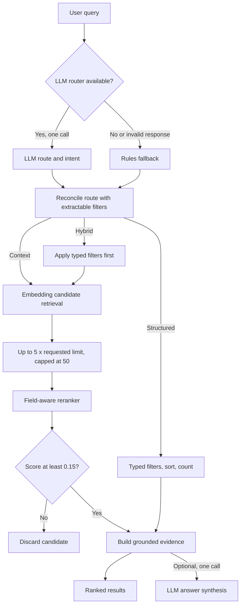
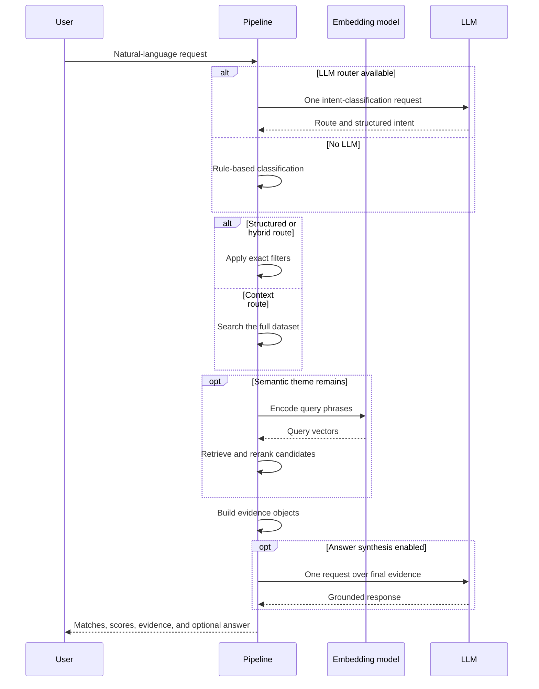
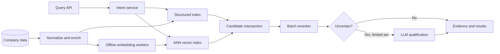

# Company Ranking and Qualification — Technical Write-up

## 1. Problem framing

The task was more about determing which which retrieved companies genuinely satisfy the user's intent, not just to simply retrieve companies related to a query.

For example, for the prompt *“Find logistics companies in Germany”*, a German freight forwarder is a direct match, a German company selling logistics software is ambiguous, and a foreign warehouse near Germany is likely not a match. A semantic only search system may retrieve all three because they are related to the same topic.

A straightforward solution would be to ask a large language model to qualify every candidate independently. I avoided that design because its cost and latency grow linearly with the number of candidates, and borderline decisions can vary between runs. Instead, I built a staged pipeline that uses the cheapest reliable operation first and reserves LLM usage for query understanding and optional answer synthesis.

The core design principle is:

> **Use deterministic filters for facts, embeddings for recall, field-aware scoring for qualification, and an LLM only where language understanding adds enough value to justify its cost.**

## 2. How my thinking evolved

### Iteration 1 — Understand the data before choosing a model

My first step was to inspect the 477 company records and identify which questions the schema of the jsonl could answer directly. Country, revenue, employee count, founding year, and public status were recoverable fields. Company activity was represented through descriptions, NAICS, target markets, business models, and core offerings.

I also found nested fields stored inconsistently, including dictionaries serialized as strings. I normalized these fields before building retrieval. Otherwise, later ranking errors could have been caused by parsing failures rather than model quality.

**Decision:** divide the schema into structured facts and semantic business evidence.

**Why:** exact facts should not be inferred by a language model or approximated by embeddings. This distinction became the basis of the routing design.

### Iteration 2 — Start with the cheapest deterministic solution

I initially built a rule-based router and keyword retrieval. The router separated prompts into:

- `structured` for exact filters and sorting;
- `context` for business meaning;
- `hybrid` for a semantic theme combined with exact constraints.

The first version handled simple location filters such as *“Companies in Romania,”* but testing more complex structured prompts exposed weaknesses in my parser. In *“Top 5 Romanian companies by revenue,”* the top-N value was initially reused as a revenue threshold. In *“Public companies with more than 10,000 employees,”* the employee value was missed because the parser expected the field name before the number. I fixed these cases by removing the top-N expression before parsing numeric thresholds and by supporting both field–value and value–field word order (*"having 100 employees or 1000 employees "*).

**Decision:** parse top-N separately, make structured extraction independent of word order where possible, and use a hybrid route whenever a prompt contains both a real theme and usable filters.

**Why:** rules are fast, reproducible, and easy to debug. I wanted them to remain authoritative for facts even after adding semantic components.

### Iteration 3 — Add embeddings for meaning, but remove filter noise

Keyword search could not reliably connect paraphrases, so I added MiniLM embeddings. My first version embedded the full user prompt against one concatenated company text.

A logistics query in Romania exposed the weakness of this design: Bunge ranked highly because long company text and geographic boilerplate produced broad similarity, while more direct logistics companies were not consistently prioritized.

**Decision:** remove structured language such as countries and numeric constraints before semantic retrieval. For a hybrid query, filter the dataset first and embed only the remaining business theme.

**Why:** “Romania” should determine eligibility, not semantic relevance. Keeping filters inside the embedding query allowed irrelevant shared words to influence rank twice.

### Iteration 4 — Replace one company embedding with field-level evidence

Even after cleaning the query, one embedding for the complete company record diluted strong evidence. A direct match in core offerings could be averaged together with a generic description.

**Decision:** embed target markets, NAICS, core offerings, and description separately, cache those vectors, and retrieve using the strongest relevant fields.

**Why:** the fields do not have the same meaning. NAICS and offerings describe what a company is and sells; target markets describe whom it serves; descriptions are broad supporting text. Field-level vectors preserved these distinctions and made later scoring explainable.

### Iteration 5 — Use an LLM for intent, but do not make it authoritative

As prompts became more varied, rules struggled with long themes, exclusions, and comparisons. I added one LLM classification call to extract the route and semantic intent.

I did not let the LLM control the route unconditionally. A model could classify a purely structured prompt as hybrid or include country names in the semantic query.

**Decision:** reconcile the LLM decision with filters and themes extracted deterministically. If the LLM is unavailable, rate-limited, or returns malformed JSON, fall back to rules.

**Why:** the LLM is useful for interpreting language, while code is more reliable for validating whether a requested constraint can actually be executed. This hybrid control plane produced stronger routing without making the system dependent on one provider.

### Iteration 6 — Separate candidate recall from qualification

Raw embedding similarity still promoted companies that were merely adjacent to the theme. My first reranker blended retrieval score directly into the final score, but this allowed broad semantic similarity to remain too influential.

I then encountered the opposite problem: a fintech query returned no candidates because the best retrieval scores were around `0.26`, below the earlier `0.28` threshold. A precision-oriented retrieval threshold had removed every candidate before qualification could inspect them.

**Decision:** make retrieval deliberately permissive—up to five times the requested result count, capped at 50, with a zero score floor in recall mode—and let a separate field-aware reranker determine precision.

**Why:** a two-stage system can recover from retrieval noise, but it cannot recover a relevant company that retrieval discarded. The candidate stage should optimize recall; the reranker should optimize qualification.

### Iteration 7 — Score what the company does, not just what it mentions

The reranker was introduced to distinguish direct evidence from topical association. I weighted NAICS and core offerings most heavily, target markets below them, and business model lowest.

I also separated specific terms from generic words such as “software,” “platform,” and “AI.” This followed failures where prompts such as “computer vision for retail” could retrieve large retailers because the context was related even though those companies did not build computer-vision products.

**Decision:** combine field-specific lexical evidence with field embeddings, penalize generic-only matches, and use exclusions as soft negatives.

**Why:** embeddings are good at answering *“is this related?”*; qualification needs to answer *“does the available company evidence support the role requested?”*

### Iteration 8 — Ground the answer layer in explicit evidence

After adding answer generation, an empty fintech result exposed a serious failure: the LLM named N26, Monzo, and TransferWise from its own knowledge even though retrieval had returned no companies. Another run reported the wrong number of matches.

**Decision:** build structured evidence objects before answer generation and give the LLM only those objects. Evidence contains supporting fields, snippets, weaknesses, and heuristic confidence. Empty evidence must produce an empty-result answer.

**Why:** the answer model should summarize the qualification system, not become an uncontrolled second retrieval system. This also makes every presented company traceable to a retrieved record.

### Iteration 9 — Model the user/company relationship explicitly

The query *“E-commerce companies using Shopify or similar platforms”* revealed a deeper ambiguity. Searching for “Shopify” found platform builders or no companies, while searching only for “e-commerce” found plausible retailers but could not prove Shopify usage.

**Decision:** add structured intent fields for primary theme, secondary theme, contrast, exclusions, and `uses_tool`. Tool profiles translate known brands into operator signals and penalize vendors that build that class of tool.

**Why:** the same term can describe different relationships. A company can build software, use software, or sell to software companies. Qualification requires representing that relationship instead of treating every query term as a positive embedding target.

This iteration also clarified an important boundary: the dataset can support *“this is an e-commerce operator,”* but it cannot verify *“this company uses Shopify.”* The system should state that limitation rather than convert plausibility into fact.

## 3. Final approach

### 3.1 System architecture

The system has six main components:

1. **Data loading and normalization** — parses each JSONL record and flattens nested address and NAICS fields.
2. **Query routing and intent decomposition** — classifies a request as `structured`, `context`, or `hybrid`, and separates the primary theme, secondary theme, exclusions, contrast, and tool-use intent.
3. **Structured filtering** — handles exact constraints such as country, city, revenue, employee count, founding year, public/private status, sorting, and limits.
4. **Semantic candidate retrieval** — retrieves a broad candidate set using cached MiniLM embeddings over separate company fields.
5. **Field-aware reranking and qualification** — combines lexical specificity, per-field semantic similarity, exclusions, and domain-specific penalties or boosts. Candidates below a minimum score are removed.
6. **Evidence and answer generation** — turns ranking signals into inspectable evidence objects and optionally asks one LLM call to summarize the final result set.

The three routes are intended for different query types:

- **Structured:** requests fully represented by typed fields, such as *“Top 5 companies by revenue in the US.”*
- **Context:** thematic requests requiring semantic interpretation, such as *“Companies developing carbon-capture technology.”*
- **Hybrid:** thematic requests with exact constraints, such as *“Logistics companies in Romania with more than 500 employees.”*

This separation matters because exact constraints should not be approximated with semantic similarity. A country code or revenue threshold can be handled faster and more reliably with a deterministic predicate.

### 3.2 Routing and intent decomposition

The default router uses an LLM at temperature zero to produce a structured intent. If the LLM is unavailable, rate-limited, or returns invalid JSON, the system falls back to rules.

The LLM output is not trusted without validation. The result is reconciled with filters that can actually be extracted from the query. This prevents a request from being routed to `hybrid` when no usable structured constraint exists, and prevents a purely structured request from carrying a noisy semantic query.

For semantic requests, the system stores:

- a primary theme;
- an optional secondary theme;
- exclusions and contrast terms;
- a `uses_tool` signal for requests such as *“e-commerce companies using Shopify.”*

The final embedding phrases are short and capped at five. Known themes receive controlled expansions—for example, `logistics` expands to phrases such as `freight transport` and `warehousing`. Exclusions and contrast terms are never embedded as positive targets.

### 3.3 Structured qualification

Structured requests are evaluated directly against normalized fields. The implementation supports:

- country, region, and selected city aliases;
- public or private status;
- minimum and maximum revenue;
- minimum and maximum employee count;
- founding-year ranges;
- sorting by revenue or employee count;
- top-N and count-style requests.

This path is deterministic, inexpensive, and explainable. Missing numeric values do not satisfy numeric filters, rather than being treated as zero.

Region names such as “Europe” are expanded into sets of ISO country codes; the system does not query the free-text `region_name` field. On the hybrid path, only narrowing filters are applied before semantic retrieval. Parsed sort and top-N instructions are not currently reapplied after reranking, so a request such as *“Top logistics companies in Romania”* is ultimately ordered by relevance rather than revenue. This is a known implementation limitation.

NAICS and website/domain terms can influence routing, but there is no structured parser for those fields. Employee ranges are also incomplete: *“between 50 and 500 employees”* currently extracts only the lower bound. These gaps should be fixed before describing the structured filter language as complete.

### 3.4 Semantic retrieval

The semantic retriever uses `sentence-transformers/all-MiniLM-L6-v2`. Instead of embedding one concatenated company description, it maintains separate normalized vectors for:

- target markets;
- primary NAICS label;
- core offerings;
- description.

The matrices are cached on disk using a fingerprint of the relevant dataset fields and model name. This avoids recomputing company embeddings when neither the data nor the model has changed.

For the normal recall path, the system scores every eligible company and keeps a wider candidate pool: five times the requested result limit, capped at 50. When that pool is wider than the requested output, recall mode uses the maximum similarity across fields with a permissive minimum score of zero. A strong match in one useful field should be enough to reach the reranker even when other fields are generic or missing.

This design favours recall at the candidate stage. Precision is delegated to the reranker.

One edge case is `--limit 50`: the candidate pool is no wider than the requested output, so recall mode is not activated. Retrieval then uses the stricter composite lexical/embedding score and the embedding index's default `0.28` threshold.

### 3.5 Field-aware reranking

The reranker exists because raw embedding similarity answers *“is this related?”* more reliably than *“does this company qualify?”*

The lexical field weights are:

- NAICS: `0.32`
- core offerings: `0.30`
- target markets: `0.23`
- business model: `0.15`

NAICS and core offerings receive the highest weights because they usually describe what the company is and what it sells. Target markets are useful but weaker: selling to logistics companies does not make a company a logistics operator. Business-model labels are broad and therefore receive the lowest weight.

The reranker also:

- separates specific terms from generic words such as “software,” “platform,” and “AI”;
- penalizes candidates matching only generic terms;
- blends field-level embedding similarity with lexical evidence;
- treats exclusions and contrast terms as soft negatives;
- applies special handling for operator-versus-vendor ambiguity;
- drops candidates with a final score below `0.15`.

The current semantic blend gives embeddings more influence when no exact specific token is present. This rescues paraphrases such as *“patient data”* versus *“health IT”*, but it can also admit semantically adjacent false positives.

### 3.6 Evidence and LLM usage

Each retained candidate is converted into an evidence object containing:

- company identity and selected structured facts;
- rerank score;
- supporting fields and snippets;
- a high, medium, or low confidence label;
- explicit weaknesses, including missing fields and absent primary-theme evidence.

The optional answerer receives these evidence objects, not the entire dataset. It is instructed not to introduce external companies or claim facts unsupported by the data.

The number of LLM calls is therefore constant with respect to candidate count: at most one routing call and one answer call per query, rather than one call per company.

The router uses temperature `0`; the answerer uses `0.2`. `--no-answer` removes only the answer call, while `--rules-only` removes both LLM calls and also disables answer synthesis.

### 3.7 Why the final combination makes sense

After these iterations, I kept the staged design because no single technique was reliable across all query types:

- Rules and typed filters are best for exact facts but cannot capture open-ended business meaning.
- Embeddings provide broad semantic recall but confuse related companies with qualifying companies.
- Handcrafted field-aware scoring is fast and inspectable but requires domain assumptions.
- LLMs understand nuanced language but introduce cost, latency, and nondeterminism.

Combining them makes the common paths cheap while preserving a path for ambiguous language. More importantly, each stage was introduced in response to an observed limitation of the previous one. The intermediate outputs—route, filters, retrieval score, field scores, and evidence—also make errors easier to diagnose than a single opaque LLM verdict.

## 4. Trade-offs

### 4.1 What I optimized for

My priorities were:

1. **Cost:** avoid per-company LLM qualification.
2. **Latency:** use local vectorized scoring and cached embeddings.
3. **Precision over raw similarity:** rerank using the fields that describe company activity.
4. **Explainability:** retain score breakdowns and evidence snippets.
5. **Robustness:** preserve a rules-only and keyword fallback path.
6. **Implementation simplicity:** keep the challenge solution runnable without external infrastructure.

### 4.2 Intentional trade-offs

**Handcrafted scoring instead of a learned reranker.**  
This is transparent and needs no labelled training set, but its fixed weights and thresholds may not transfer across industries or query types.

**MiniLM instead of a larger embedding or cross-encoder model.**  
MiniLM is small and fast enough for a local challenge implementation. The cost is weaker understanding of subtle role distinctions such as operator versus software vendor.

**High-recall candidate retrieval.**  
The normal recall path uses the strongest field similarity and a permissive threshold before reranking. This reduces the chance of losing a valid match early, but passes more noise to the qualification stage. The behaviour changes when the requested limit reaches the 50-candidate cap, which is an inconsistency I would remove in a production version.

**Soft exclusions rather than hard removal.**  
Soft penalties are safer when a contrast term appears incidentally, but a company dominated by an excluded activity may remain in the final list.

**Rules plus an LLM router.**  
The LLM handles varied phrasing, while reconciliation and fallback rules add stability. The downside is one optional model call and two sources of routing behaviour that must be kept consistent.

**Special-case tool profiles.**  
Profiles for Shopify-, payment-, ERP-, CRM-, and EHR-style queries improve operator-versus-vendor handling. They are useful but manually maintained and incomplete.

**Single-process implementation.**  
The current system is easy to inspect and run, but it reloads and normalizes the JSONL file for each query and performs exact scoring over the eligible rows. This is appropriate for 477 companies, not for production scale.

## 5. Evaluation

### 5.1 What is currently measured

The repository includes a golden set of 71 prompts that checks:

- route selection (`structured`, `context`, or `hybrid`);
- whether structured-only prompts have an empty semantic query;
- whether semantic queries retain expected theme terms.

On the current rules-only implementation:

> **70 of 71 routing cases pass (98.6%).**

A development run using the local `qwen2.5:7b` LLM followed by route reconciliation passed **71 of 71** cases on the same set. That number is model- and environment-dependent; the rules-only result is the deterministic baseline.

The failing case is:

> *“Companies that manufacture or supply critical components for electric vehicle battery production”*

The rules route it correctly as `context`, but extracts `manufacture or critical components` and loses the more informative `electric vehicle battery` terms.

This evaluation is useful but limited. It checks route labels and substrings in `semantic_query`; it does not validate embedding queries, extracted intent fields, filters, or returned companies. It measures **routing, not end-to-end company ranking quality**. The repository also has no dedicated unit or integration test suite. I do not yet have human-labelled query/company relevance judgments, so I should not claim a measured Precision@K, Recall@K, or NDCG.

### 5.2 Evaluation I would add

I would create a benchmark of query/company pairs labelled as:

- direct match;
- adjacent or debatable;
- non-match.

Labels should be produced independently by at least two reviewers, with disagreements adjudicated. I would report:

- Precision@K and Recall@K;
- NDCG@K, preserving graded relevance;
- false-positive rate among qualified candidates;
- performance split by structured, context, and hybrid queries;
- latency and LLM cost per route.

I would also run ablations:

1. raw embeddings only;
2. embeddings plus lexical field scoring;
3. full reranker;
4. full reranker plus uncertainty-based LLM qualification.

That would show whether each layer adds enough accuracy to justify its complexity.

## 6. Error analysis

### 6.1 Hybrid retrieval can return unrelated companies

For the rules-only query:

> *“Logistics companies in Germany”*

the route and country filter are correct, but the top results include:

- Phin, a financial-services and mobile-banking company;
- HRWare Consulting, an HR software consultancy;
- Paychex, a payroll and HR provider.

Their rerank scores are only approximately `0.17`, but they pass the global `0.15` threshold. Their company fields contain no convincing logistics activity.

**Why this happens**

- The structured filter leaves a small German subset.
- Recall-mode retrieval accepts candidates based on broad field embedding similarity.
- Field embeddings can produce weak positive similarity for unrelated business descriptions.
- The global rerank threshold is permissive and is not calibrated by query or candidate-pool quality.
- Any weak candidate above the threshold can remain, although the system does not pad the result list to reach the requested limit.

**Potential fix**

- Require minimum primary-theme evidence in NAICS, offerings, or markets.
- Introduce an abstention rule when the top score or score margin is too low.
- Calibrate thresholds on labelled relevance data.
- Use a cross-encoder or LLM only for uncertain candidates near the decision boundary.

### 6.2 Tool use is not present in the dataset

For:

> *“E-commerce companies using Shopify or similar platforms”*

the system retrieves plausible online retailers such as Coles, H&M Home, Forever 21, Toys“R”Us, and Lululemon. Their e-commerce activity is supported by business-model or offering fields, but the dataset does not record their commerce platform.

**Why this is dangerous**

The query contains two claims:

1. the company operates in e-commerce;
2. the company uses Shopify or a similar platform.

The data can support the first claim but not the second. This was observed during development: an earlier answer described retailers as companies that “likely” use Shopify despite having no platform evidence. A fluent answer model had converted *“plausible operator”* into an unsupported factual inference.

**Current mitigation**

- `uses_tool` is separated from the primary theme.
- Tool brands are expanded into operator signals rather than embedded as vendor targets.
- Platform vendors are penalized.
- Evidence explicitly says tool usage is not recorded.
- The answer prompt forbids claiming or denying tool use.

**Remaining limitation**

The result is still a list of possible operators, not verified Shopify users. The correct production response should expose this distinction clearly or abstain from the tool-use portion of the request.

### 6.3 Semantic-query extraction can remove the most useful terms

For the electric-vehicle battery-components query above, the rules-only `semantic_query` retains generic words and loses the key domain phrase. However, intent decomposition also produces an embedding query containing `electric vehicle battery production`. That secondary phrase allows the retrieval stage to find plausible companies such as Sepion Technologies, whose fields explicitly mention electric-vehicle battery components.

This result demonstrates both a weakness and a useful safeguard: the scalar `semantic_query` fails the golden-set expectation, while the multi-query retrieval path preserves enough intent to recover relevant companies. The evaluation should eventually validate the complete intent object rather than only one string.

**Potential fix**

- Preserve noun phrases before removing boilerplate.
- Prefer known multiword domain entities such as `electric vehicle battery`.
- Add regression cases for long supplier/manufacturer prompts.
- Compare rule output with the original prompt and fall back when information loss is high.

### 6.4 Ungrounded answer generation can hide retrieval failures

During an early fintech test, candidate retrieval returned an empty set, but the answer model named N26, Monzo, and TransferWise from its own knowledge. A separate answer-count bug reported only three matching companies when ten had been retrieved.

These failures occurred after retrieval, so improving embedding quality alone would not solve them. They motivated:

- building evidence objects before calling the answer model;
- instructing the model to use only those objects;
- passing the structured `match_count` where available;
- explicitly returning “no matches” when evidence is empty;
- treating answer quality and ranking quality as separate evaluation targets.

Prompt grounding reduces this risk but does not mathematically guarantee factual output. Production monitoring should still check whether every named company and claim can be traced to an evidence object.

### 6.5 Missing values affect qualification

In the 477-company dataset:

- 39.4% of companies lack employee count;
- 27.5% lack founding year;
- 19.5% lack revenue;
- 8.0% lack a website.

Numeric filtering deliberately excludes missing values. This avoids treating unknown as zero, but it can create false negatives. For example, a relevant company with unknown revenue cannot satisfy a revenue threshold even if its true revenue would qualify.

Semantic fields are currently populated in this dataset, but their quality and specificity vary. A generic generated description may still be less useful than a precise offerings list.

## 7. Failure modes

The system can produce confident but incorrect results when:

- semantic relatedness is mistaken for direct qualification;
- a target-market field is interpreted as the company’s own industry;
- a vendor of a tool is confused with an operator using that tool;
- a company’s operating location is confused with its headquarters;
- missing data silently removes an otherwise valid result;
- stale or incorrect enrichment fields agree with one another and amplify a bad match;
- generic terms produce positive similarity across several fields;
- the retrieval tie-break favours larger employee counts even when company size was not requested;
- duplicate company names or missing stable IDs cause ambiguous joins and repeated entities;
- fixed weights or the `0.15` threshold are unsuitable for a new domain;
- the true match is absent from the top-50 retrieval pool and can never be recovered;
- the LLM router changes intent decomposition between models or versions;
- the answer model turns a caveated possibility into a factual claim.

Confidence is currently derived from heuristic score thresholds and the number of supporting fields. It is not a calibrated probability. Calling a result “high confidence” therefore means *strong according to this scoring design*, not *empirically correct with a known probability*.

### 7.1 Production monitoring

I would monitor:

- Precision@K, Recall@K, and NDCG on a continuously reviewed sample;
- false-positive rates by query type, industry, country, and route;
- human disagreement on borderline qualification;
- score distributions, top-score margins, and abstention rate;
- route distribution and disagreement between LLM and rules;
- missing-field rates and source-data freshness;
- candidate recall before reranking;
- percentage of queries with zero or only low-confidence matches;
- latency for loading, filtering, embedding, reranking, and LLM calls;
- LLM request cost, timeout rate, parse failures, and fallback frequency;
- answer-grounding violations, especially unsupported tool-use claims;
- drift in query language and embedding distributions.

Alerts should focus on changes relative to a baseline, not only fixed thresholds. A sudden rise in high-confidence results or a collapse in abstentions could indicate score drift rather than improved quality.

## 8. Scaling to 100,000 companies per query

The current implementation scans Python lists and performs exact vector operations over all eligible rows. At 100,000 companies, repeatedly loading JSONL, normalizing records, and scanning every vector would dominate latency and memory.

I would replace the local data path with:

1. **Indexed structured storage** — PostgreSQL, Elasticsearch/OpenSearch, or another store with indexes for country, city, revenue, employees, year, and public status.
2. **An approximate nearest-neighbour index** — FAISS, Qdrant, Milvus, or OpenSearch k-NN for precomputed field embeddings.
3. **Offline enrichment and embedding jobs** — versioned embeddings generated only for changed companies.
4. **Two-stage retrieval** — apply structured constraints first, retrieve a few hundred semantic candidates, then rerank only that set.
5. **A batchable learned reranker** — a cross-encoder or trained lightweight model over the top candidates.
6. **Uncertainty-based LLM escalation** — call an LLM only for high-value candidates near the qualification boundary.
7. **Caching and observability** — cache normalized queries and frequent result sets, and trace latency and scores across each stage.

At millions of companies, I would also shard or partition by stable structured attributes, use asynchronous ingestion, version models and embeddings, and run shadow evaluations before changing ranking logic.

The key scaling idea is that the LLM budget should depend on **uncertainty**, not corpus size.

## 9. Assumptions and limitations

The current design assumes:

- the company records and enrichment fields are reasonably accurate;
- one address country is a valid interpretation of “companies in” a location;
- the primary NAICS label is a strong industry signal;
- secondary NAICS data can be ignored without losing critical evidence;
- English MiniLM embeddings are adequate for the query and enrichment language;
- manually chosen field weights generalize across domains;
- a true match is likely to appear in the top recall pool;
- missing numeric data should fail numeric predicates;
- semantic confidence can be approximated from field support.

Several of these assumptions are unverified. In particular, field weights, the candidate cap, and confidence thresholds were selected heuristically rather than learned or calibrated on relevance labels. The current flattening step discards `secondary_naics`, and the data has no stable company identifier; those are implementation shortcuts rather than desirable production properties.

## 10. Where the system works well

The system is strongest when:

- a query contains exact structured constraints represented in the dataset;
- the business theme appears explicitly in NAICS or core offerings;
- a hybrid query can reduce the semantic search space with reliable filters;
- the query uses common industry language covered by intent expansions;
- evidence is present in more than one independent company field.

Structured requests are especially attractive because they are deterministic and do not require embeddings for retrieval.

A useful positive case during development was a hybrid query for B2B HR SaaS companies in Europe. The country-set filter reduced the search space, while offerings and business-model evidence promoted companies such as Moorepay and Paychex. Another Romania logistics iteration surfaced companies such as STILL, CFR, and Portul Constanța after field-level retrieval replaced the original full-blob approach.

## 11. Improvements I would prioritize

1. **Create a labelled end-to-end relevance benchmark.** Without it, ranking improvements cannot be measured reliably.
2. **Calibrate qualification and confidence thresholds.** Add explicit abstention instead of returning weak matches.
3. **Require claim-specific evidence.** Distinguish “is an e-commerce operator” from “uses Shopify.”
4. **Improve noun-phrase intent extraction.** Preserve long domain concepts and add regression tests.
5. **Evaluate a cross-encoder reranker.** Compare its quality and latency against the current heuristic scorer.
6. **Add uncertainty-based LLM escalation.** Qualify only borderline top candidates, preferably in batches.
7. **Measure candidate recall.** Confirm that the top-50 pool is large enough before tuning the reranker.
8. **Move storage and retrieval to indexed services** before increasing the corpus substantially.

## 12. Final reflection

The main lesson from this implementation is that retrieval score is not qualification evidence. Embeddings are useful for finding related candidates, but the difficult part is deciding what kind of relationship the user requested and whether the available fields prove it.

The staged architecture significantly reduces LLM usage and exposes useful intermediate signals, but the current reranker remains heuristic. Its routing evaluation is strong, while observed ranking errors show that a correct route does not guarantee correct companies.

My next step would therefore not be to add more rules immediately. It would be to build a small, carefully labelled relevance set, measure the complete pipeline, and use those results to calibrate thresholds and decide where a learned reranker or selective LLM qualification provides the most value.
